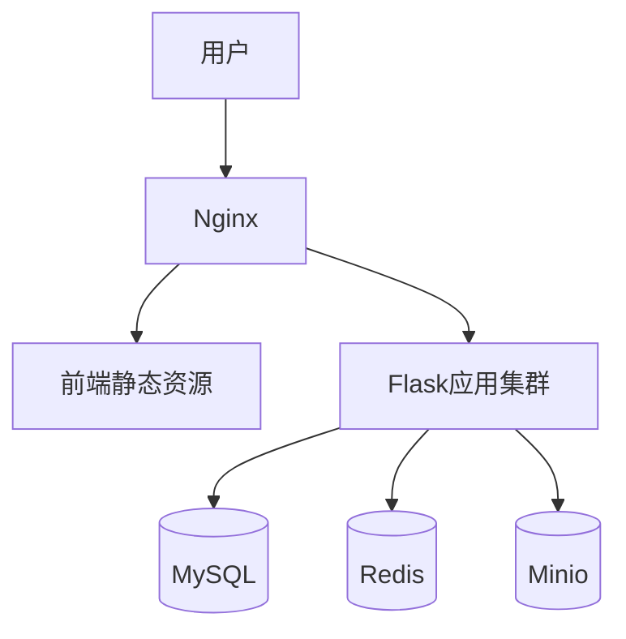

# WANGZI's Tech Blog 🚀

## 🏗️ 技术栈版本与选型依据

          

**线上演示**：https://www.wzportia.tech/

## 🎯 项目定位

一个全栈开发的个人博客，集技术分享、日常感悟、个人成长于一体，核心功能：
- **技术实践**：展示项目开发经验
- **持续学习**：分享日常学习心得
- **计划执行**：记录个人成长计划

## 🛠 技术全景

| 领域       | 技术选型                |
| ---------- | ----------------------- |
| **前端**   | JavaScript + CSS + HTML |
| **后端**   | Python + Flask          |
| **数据库** | MySQL + Minio           |
| **运维**   | Docker + Nginx          |

## 🖥 系统架构

